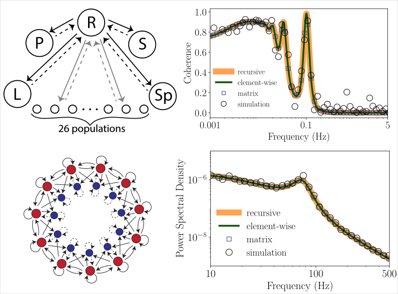

# spectre

This repositry contains various algorithms (recursive, element-wise, matrix inverse and simulation) to calculate the power spectral density of stochastic dynamical models exhibiting fixed point solutions.

We include examples of various biological dynamical systems:
1. FitzHugh-Nagumo
2. Hindmarsh-Rose
3. Wilson-Cowan 4D
4. Stabilized Supralinear Network (SSN)
5. Rock-Paper-Scissors-Lizard-Spock (RPSLS) (5 and 31 dimensional versions)



## Installation

Follow these steps to install spectre:

1. Clone the repository:
    ```bash
    git clone https://github.com/martiniani-lab/spectre.git
    cd spectre
    ```
2. Add the current directory to your Python path:
    ```bash
    export PYTHONPATH=$(pwd):$PYTHONPATH
    ```

## Usage

### Defining a model
The classes for various models are defined at the location,
```bash
    spectre/model/
```
The nonlinear dynamical system is defined in the function '_dynamical_fun'. For example, for Fitzhugh-Nagumo model, the function looks like,
```python
    def _dynamical_fun(self, t, x):
        x = x.squeeze(0)
        v = x[0:1]
        w = x[1:2]
        dvdt = v - v**3 / 3 - w + self.I
        dwdt = self.epsilon * (v + self.alpha - self.beta * w)
        return torch.cat((dvdt, dwdt))
```
Once this class is instantiated, the fixed point, the Jacobian matrix and the noise matrices are calculated automatically.

### Calculating the power spectral density / cross-spectrum / coherence
Example code to calculate the power spectral density of a variable,
```python
    import torch
    from spectre.spectrum_general import matrix_solution
    from spectre.spectrum_general import sim_solution
    from spectre.spectrum_general import element_wise
    from spectre.spectrum_general import recursive_solution
    from spectre.model import HR

    # Instantiate the model
    model = HR(eta1=0.001, I=5.5)

    # Define the frequency vectors
    freq = torch.logspace(np.log10(1e-4), np.log10(10), 100)

    # Index of the variable of which the spectrum is desired
    idx = 0

    # Analytical solution (recursive algorithm)
    recursive_model = recursive_solution(model.J, model.L, model.S)
    psd_recursive, _ = recursive_model.auto_spectrum(idx, freq)

    # Analytical solution (elementwise)
    rat_model = element_wise(model.J, model.L, model.S)
    psd_rational, _ = rat_model.auto_spectrum(idx, freq)

    # Analytical solution (matrix)
    mat_model = matrix_solution(model.J, model.L, model.S)
    psd_matrix, _ = mat_model.auto_spectrum(idx, freq)

    # Simulation solution
    sim_model = sim_solution(model, sde_sim_method="euler")
    psd_sim, f = sim_model.simulation_spectrum(
        i=idx, ndivs=10, n_points=int(1e6), time=int(5e4), dt=0.04
    )
```

To calculate the cross-spectrum between any two variables,
```python
    # Indices of variables of which the spectrum is desired 
    i = 0
    j = 1

    # Analytical solution (recursive algorithm)
    cpsd_recursive, _ = recursive_model.cross_spectrum(i, j, freq)

    # Analytical solution (elementwise)
    cpsd_rational, _ = rat_model.cross_spectrum(i, j, freq)

    # Analytical solution (matrix)
    cpsd_matrix, _ = mat_model.cross_spectrum(i, j, freq)

    # Simulation solution
    cpsd_sim, f = sim_model.simulation_spectrum(
        i=i, j=j, ndivs=10, n_points=int(1e6), time=int(5e4), dt=0.04
    )
```

To calculate the coherence between any two variables,
```python
    # Indices of variables of which the spectrum is desired 
    i = 0
    j = 1

    # Analytical solution (recursive algorithm)
    coh_recursive, _ = recursive_model.coherence(i, j, freq)

    # Analytical solution (elementwise)
    coh_rational, _ = rat_model.coherence(i, j, freq)

    # Analytical solution (matrix)
    coh_matrix, _ = mat_model.coherence(i, j, freq)

    # Simulation solution
    coh_sim, f = sim_model.simulation_coherence(
        i=i, j=j, ndivs=10, n_points=int(1e6), time=int(5e4), dt=0.04
    )
```

### Coefficients of the rational function
The spectral density, cross-spectrum and coherence can be expressed as rational functions of the frequency. We can obtain the coefficient matrices using the recursive solution as follows,
```python
    # Numerator
    P = recursive_model.P
    P_prime = recursive_model.P_prime

    # Denominator
    q = recursive_model.q
```

The individual coefficients for auto-spectrum, using the element-wise solution, can be obtained as follows,
```python
    # Numerator
    p = rat_model.p_auto_all_coeffs(i=idx)

    # Denominator
    q = rat_model.q_all_coeffs()
```

The coefficients of the rational functions for the cross-spectrum and coherence can be obtained similarly.

### Formulae for coefficients for the auto-spectrum
To obtain the formulae for the coefficeints of the rational function of auto-spectrum for a specific structure of noise, check the following notebook,
```bash
    examples/symbolic_psd.ipynb
```
Similar general formulae can be obtained for the cross-spectrum and coherence.


## Reference and Citation
The algorithms and results for various models are described in the preprint:

> *Element-wise and Recursive Solutions for the Power Spectral Density of Biological Stochastic Dynamical Systems at Fixed Points*
> 
> Shivang Rawat and Stefano Martiniani
>
> https://arxiv.org/abs/2305.19890

```bibtex
@article{rawat2023element,
  title={Element-wise and Recursive Solutions for the Power Spectral Density of Biological Stochastic Dynamical Systems at Fixed Points},
  author={Rawat, Shivang and Martiniani, Stefano},
  journal={ArXiv},
  year={2023},
  publisher={arXiv}
}
```